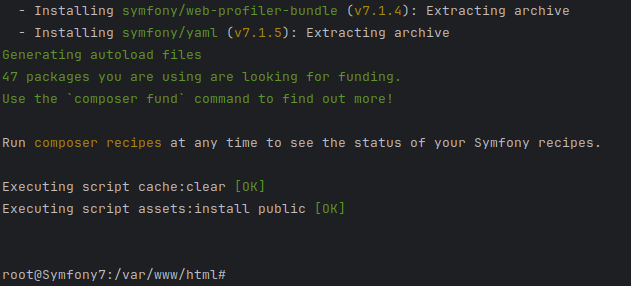

# Symfony7 Dotien project

🚀 **Quickly set up Dotien API-a!**

## Getting Started

1. Run the `./dkbuild.sh` file to build your container images and run the application.
2. Next, run `./dkconnect.sh` to connect to the `app` service container where the *Symfony7* application is running.

   

3. Run `symfony composer install` to install the application and it's dependencies.
4. Run `symfony console doctrine:database:create` to create database.
5. Run `symfony console doctrine:migrations:migrate` to migrate migrations.

   

## Where to Next?

Congratulations on getting to this point. When you run
Your URL for api is:
Your URL for DB admin dashboard is:

